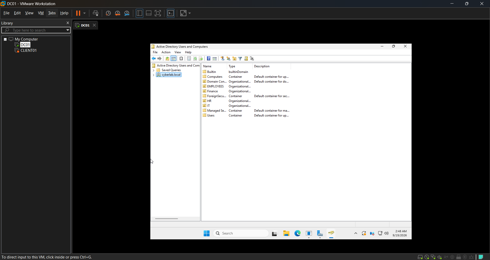
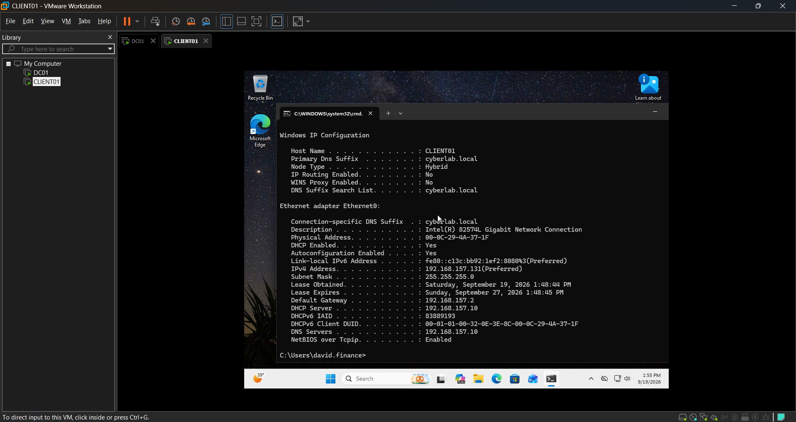

# Averine Holding Limited — Windows Server and Active Directory Home Lab

## Project Overview

This project demonstrates the design, configuration and troubleshooting of a small Windows enterprise network for the fictional business environment of Averine Holding Limited.

The lab was built in VMware Workstation Pro using Windows Server 2025 Standard Evaluation and a Windows 11 client. It provides hands-on experience with Active Directory Domain Services, DNS, DHCP, Group Policy, user administration, security groups, shared folders, mapped drives and NTFS permissions.

This is a personal learning environment—not a production business network.


## Business Scenario

Averine Holding Limited requires a centralized Windows environment for managing employees in its HR, Finance and IT departments.

The environment must provide:

* Centralized user authentication
* Departmental organizational units
* Security-group-based access
* Automatic IP configuration
* Internal DNS resolution
* Group Policy management
* Departmental shared folders
* Mapped network drives
* Account and password security policies
* A structured troubleshooting process

## Lab Architecture

| Component               | Configuration                           |
| ----------------------- | --------------------------------------- |
| Hypervisor              | VMware Workstation Pro                  |
| Network                 | VMnet8 NAT                              |
| Domain                  | `cyberlab.local`                        |
| Domain controller       | `DC01`                                  |
| Server operating system | Windows Server 2025 Standard Evaluation |
| DC01 address            | `192.168.157.10/24`                     |
| Default gateway         | `192.168.157.2`                         |
| Client computer         | `CLIENT01`                              |
| Client operating system | Windows 11                              |
| Client address          | Assigned by DC01 DHCP                   |
| DHCP scope              | `192.168.157.100–192.168.157.200`       |
| Internal DNS server     | `192.168.157.10`                        |

## Server Roles

DC01 provides the following services:

* Active Directory Domain Services
* DNS Server
* DHCP Server
* Group Policy management
* File and folder sharing
* Centralized user and computer administration

## Active Directory Structure

The domain contains organizational units for:

* Employees
* HR
* Finance
* IT

Example domain users include:

* Sarah — HR
* David Finance — Finance
* Test User — IT

Security groups include:

* `HR-Users`
* `Finance-Users`
* `IT-Users`
* `IT-Support`



## DNS Configuration

DC01 hosts the `cyberlab.local` DNS zone.

Configured records include:

* DC01 host record
* Reverse lookup records
* `fileserver.cyberlab.local`
* `files.cyberlab.local` CNAME alias
* Active Directory SRV records

DNS validation was performed using commands such as:

```cmd
nslookup dc01.cyberlab.local
nslookup -type=SRV _ldap._tcp.dc._msdcs.cyberlab.local
ipconfig /flushdns
```

## DHCP Configuration

DC01 contains an authorized DHCP scope for CLIENT01 and future client computers.

The scope provides:

```text
Address range:   192.168.157.100–192.168.157.200
Subnet mask:     255.255.255.0
Default gateway: 192.168.157.2
DNS server:      192.168.157.10
```

VMware’s built-in DHCP service was disabled on VMnet8 to prevent it from competing with the DHCP service on DC01.



## Group Policy

The lab includes Group Policy configurations for:

* Minimum password length of 12 characters
* Account lockout after five failed attempts
* Ten-minute lockout duration
* Ten-minute lockout observation window
* Restricting access to Control Panel and PC Settings
* Preventing unauthorized desktop-background changes
* Mapping departmental network drives

Policy application is tested using:

```cmd
gpupdate /force
gpresult /r
```

## Shared Folders and Permissions

Departmental shared folders include:

| Shared folder  | Authorized group | NTFS access |
| -------------- | ---------------- | ----------- |
| IT-Shared      | IT-Support       | Modify      |
| HR-Shared      | HR-Users         | Modify      |
| Finance-Shared | Finance-Users    | Modify      |

Access testing demonstrated that:

* HR users can access the HR share.
* Finance users can access the Finance share.
* Unauthorized users are denied access.
* IT users receive their mapped drive through Group Policy.
* Share and NTFS permissions are evaluated together.
* The most restrictive effective permission applies.

## Security Controls

Security practices implemented in the lab include:

* Least-privilege access
* Group-based authorization
* Password and account-lockout policies
* Separate departmental resources
* NTFS and share-permission testing
* Domain-based authentication
* Restricted user settings through Group Policy
* Configuration validation after changes

## Troubleshooting Method

I use the following structured process when investigating incidents:

1. Verify the signed-in account with `whoami`.
2. Inspect the network configuration with `ipconfig /all`.
3. Test connectivity using `ping`.
4. Test name resolution using `nslookup`.
5. Test the affected service directly.
6. Check group membership and permissions.
7. Check Group Policy application.
8. Apply one controlled fix.
9. Retest the original problem.
10. Document the root cause and result.

## Troubleshooting Case Studies

### Case Study 01 — Competing DHCP Servers

CLIENT01 received DHCP and DNS information from VMware instead of DC01. I verified the Windows DHCP scope, identified the competing VMware DHCP service, disabled it on VMnet8, renewed the client lease and confirmed that DC01 was supplying both DHCP and DNS.

[Read Case Study 01](case-studies/Case-Study-01-Competing-DHCP-Servers.md)

Additional case studies will cover:

* Incorrect DNS configuration
* APIPA addressing
* Domain-join failures
* Missing mapped drives
* Share and NTFS permission problems
* Incorrect security-group membership
* Group Policy failures
* Computer trust relationship failures

## Skills Demonstrated

* Windows Server installation and configuration
* Active Directory administration
* User, group and OU management
* DNS and DHCP administration
* Windows 11 domain joining
* Group Policy configuration
* Shared-folder administration
* Share and NTFS permissions
* VMware virtual networking
* Command-line diagnostics
* Structured root-cause analysis
* Technical documentation

## Validation Commands

Commands used throughout the project
