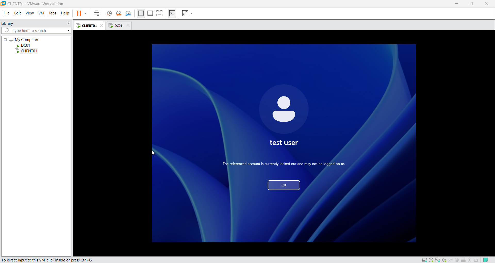
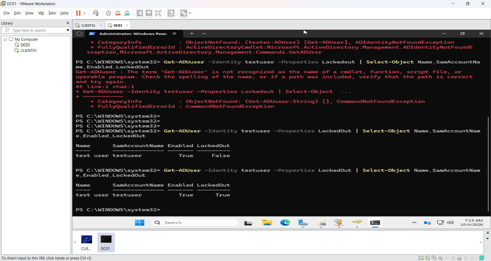
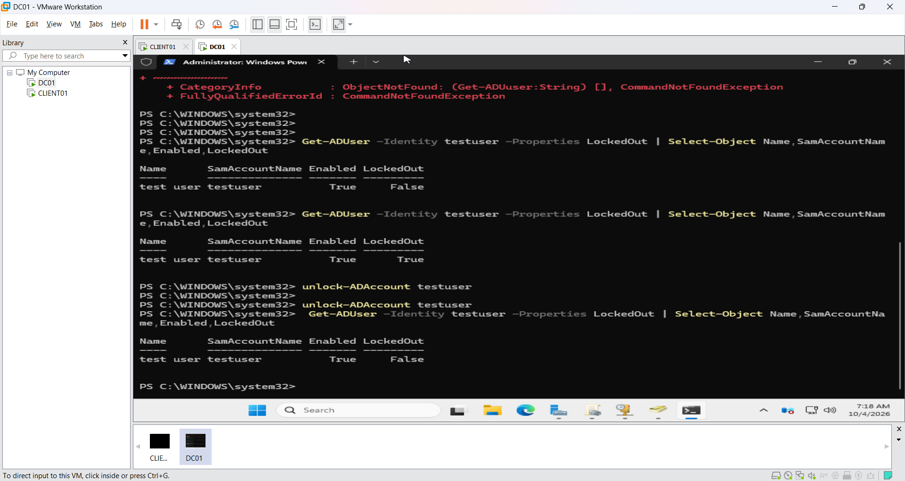
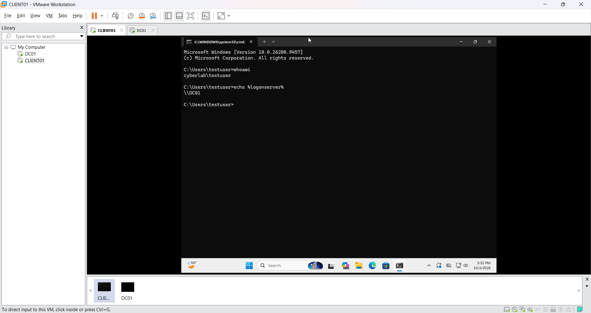

# Ticket #011 — Domain User Account Locked Out

## Ticket Summary

A domain user, `CYBERLAB\testuser`, was unable to sign in to CLIENT01. Windows reported that the account was locked out.

## Lab Environment

- Domain: `cyberlab.local`
- Domain Controller: `DC01`
- Client Computer: `CLIENT01`
- Affected Account: `testuser`
- Server: Windows Server 2025
- Client: Windows 11
- Lockout Threshold: 5 failed attempts
- Lockout Duration: 10 minutes

## User-Reported Issue

The user received this message:

> The referenced account is currently locked out and may not be logged on to.



## Investigation

The account was checked from DC01 using PowerShell:

```powershell
Get-ADUser -Identity testuser -Properties LockedOut |
Select-Object Name,SamAccountName,Enabled,LockedOut
```

The result showed:

```text
Enabled   : True
LockedOut : True
```

This confirmed that the account existed and was enabled, but Active Directory had locked it.



## Root Cause

The user entered an incorrect password five times. This reached the domain account-lockout threshold and temporarily locked the account.

## Resolution

The account was manually unlocked from DC01:

```powershell
Unlock-ADAccount testuser
```

The account status was checked again:

```powershell
Get-ADUser -Identity testuser -Properties LockedOut |
Select-Object Name,SamAccountName,Enabled,LockedOut
```

The result changed to:

```text
Enabled   : True
LockedOut : False
```



## Final Validation

The user successfully signed in to CLIENT01 with the correct password.

The following commands confirmed the user identity and authenticating domain controller:

```cmd
whoami
echo %logonserver%
```

Results:

```text
cyberlab\testuser
\\DC01
```



## Resolution Status

**Resolved:** The account lockout was identified, manually removed and successfully tested from CLIENT01.

## Key Lesson

An Active Directory account can be enabled but still unable to authenticate because it is locked:

```text
Enabled: False   → The account is disabled
LockedOut: True  → The failed-login threshold was exceeded
```

Useful commands:

```powershell
Get-ADUser testuser -Properties LockedOut
Unlock-ADAccount testuser
```